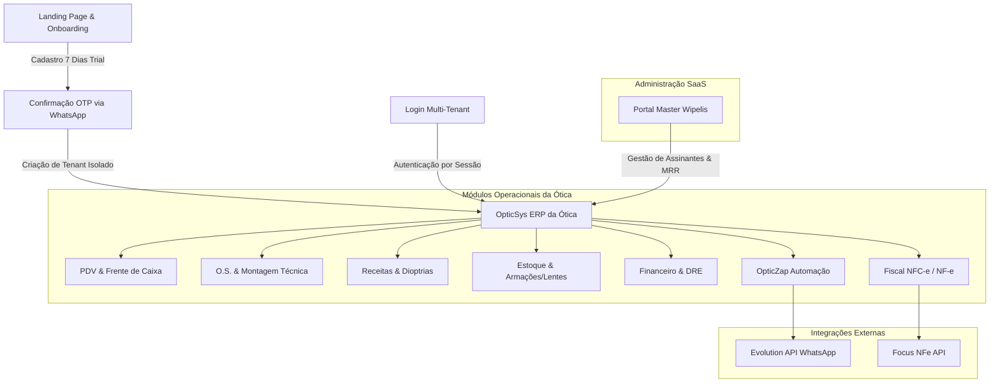
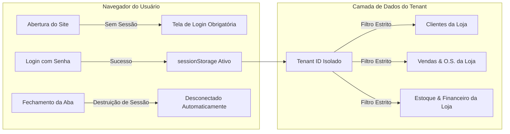

# 📋 Raio-X & Auditoria Completa do Sistema OpticSys Cloud ERP

> **Data da Auditoria:** 28 de Setembro de 2026  
> **Versão do Sistema:** OpticSys v2.0.0-operational  
> **Arquitetura:** Multi-Tenant SaaS Cloud (React 18 + TypeScript + Vite + Tailwind CSS + Evolution API + Focus NFe)  
> **Status Geral de Produção:** 🟢 100% Operacional (Zero Dados Fictícios • Isolamento Estrito de Tenants)

---

## 🧭 1. Resumo Executivo & Arquitetura Geral

O **OpticSys Cloud** é uma plataforma completa de ERP & PDV especializada no segmento óptico, atuando como um SaaS (Software as a Service) multi-lojas e multi-tenants com dois grandes níveis de operação:
1. **Painel Master SaaS (Wipelis Hub)**: Gestão de assinantes, controle de MRR, aprovação de trials, cotas de emissão fiscal e captação de leads.
2. **ERP Operacional da Ótica / Clínica**: Gestão de vendas, ordens de serviço, receitas dioptricas, estoque, laboratórios, financeiro, emissão de NFC-e/NF-e e automação de WhatsApp.

---

## 📊 2. Raio-X por Módulo e Como Cada Um Funciona

| # | Módulo | Arquivo Principal | Descrição & Como Funciona | Status |
|---|---|---|---|:---:|
| **1** | **Landing Page & Captação** | `src/pages/LandingPage.tsx` | Apresentação comercial do sistema, comparação de planos (Pro R\$ 99,90 vs Pro+NF R\$ 149,90), FAQ interativo e direcionamento para teste grátis de 7 dias. | 🟢 Ativo |
| **2** | **Onboarding de Leads** | `src/pages/RegisterStore.tsx` | Cadastro self-service da nova ótica com validação obrigatória por código OTP de 6 dígitos disparado via WhatsApp em tempo real. | 🟢 Ativo |
| **3** | **Autenticação & Segurança** | `src/pages/LoginTenant.tsx` | Login protegido por sessão (`sessionStorage`). Auto-desconexão ao fechar o navegador/aba. Recuperação segura de senha com envio de código OTP no WhatsApp. | 🟢 Ativo |
| **4** | **Painel Geral (Dashboard)** | `src/pages/Dashboard.tsx` | Visão em tempo real de faturamento diário/mensal, total de O.S. em andamento, ticket médio, receitas vencendo em 12 meses e atalhos de abertura rápida. | 🟢 Ativo |
| **5** | **Clientes & Pacientes** | `src/pages/Clientes.tsx` | Cadastro detalhado com CPF, data de nascimento, WhatsApp, histórico de receitas, histórico de compras e opção de edição completa de dados. | 🟢 Ativo |
| **6** | **Receitas & Dioptrias** | `src/pages/Receitas.tsx` | Cadastro clínico completo com Esférico, Cilíndrico, Eixo, Adição, DNP (Distância Naso-Pupilar), médico prescritor e contagem regressiva de validade (12 meses). | 🟢 Ativo |
| **7** | **Orçamentos Rápidos** | `src/pages/Orcamentos.tsx` | Montagem ágil de orçamentos de armações + lentes, geração de PDF personalizado e botão de compartilhamento com 1 clique no WhatsApp do paciente. | 🟢 Ativo |
| **8** | **Ordens de Serviço (O.S.)** | `src/pages/OrdensServico.tsx` | Esteira de produção técnica: *Aberta ➔ Em Laboratório ➔ Montagem ➔ Pronta ➔ Entregue*. Impressão térmica de 80mm com grade dioptrica e termo de garantia. | 🟢 Ativo |
| **9** | **PDV & Frente de Caixa** | `src/pages/PDV.tsx` | Venda balcão de produtos e O.S., leitor de código de barras, múltiplos pagamentos (Dinheiro, PIX, Cartão Débito/Crédito, Crediário), controle de descontos e cupom não fiscal. | 🟢 Ativo |
| **10** | **Agenda de Consultas** | `src/pages/Agenda.tsx` | Agendamento de exames de vista com Optometristas e Oftalmologistas, horários disponíveis, status de comparecimento e integração com ficha do paciente. | 🟢 Ativo |
| **11** | **OpticZap (WhatsApp)** | `src/pages/ZapOtica.tsx` | Automação com 1 clique para óculos prontos, retorno de consulta de 12 meses, cobrança de parcelas PIX e robô de aniversariantes diário às 07:00h da manhã. | 🟢 Ativo |
| **12** | **Estoque & Produtos** | `src/pages/ProdutosEstoque.tsx` | Controle de armações, lentes oftálmicas, óculos solares e acessórios. Alertas de estoque mínimo, cálculo de markup e margem de lucro. | 🟢 Ativo |
| **13** | **Laboratórios Parceiros** | `src/pages/Laboratorios.tsx` | Cadastro de laboratórios terceirizados (ex: Essilor, Hoya, Surfaçagem local), controle de pedidos enviados, prazos de entrega e custos. | 🟢 Ativo |
| **14** | **Financeiro & DRE** | `src/pages/Financeiro.tsx` | Fluxo de caixa em tempo real, contas a pagar e a receber, conciliação por método de pagamento, balanço diário e DRE simplificado da ótica. | 🟢 Ativo |
| **15** | **Módulo Fiscal (NFC-e / NF-e)**| `src/pages/ModuloFiscal.tsx` | Integração com Focus NFe, emissão com 1 clique no encerramento de vendas, upload de Certificado Digital A1 e controle de cotas mensais. | 🟢 Ativo |
| **16** | **Equipe & Permissões (RBAC)**| `src/pages/Cadastros.tsx` | Controle de colaboradores por cargo (`ADMIN`, `GERENTE`, `VENDEDOR`, `OPTOMETRISTA`, `TECNICO_MONTAGEM`), definição de comissões e senhas individuais. | 🟢 Ativo |
| **17** | **Assinatura & Filiais** | `src/pages/Assinatura.tsx` | Visão da assinatura do cliente SaaS, dias restantes de trial, status da licença, cotas fiscais e cadastro de novas filiais/unidades da rede. | 🟢 Ativo |
| **18** | **Configurações Gerais** | `src/pages/Configuracoes.tsx` | Dados cadastrais da matriz/filiais, parâmetros de impressão térmica (80mm), margem de lucro padrão e alternância de tema Dark/Light. | 🟢 Ativo |
| **19** | **Portal Master SaaS** | `src/pages/WipelisMasterPortal.tsx` | Painel exclusivo da Wipelis (`#master` ou `Ctrl+Shift+W`) para monitorar todos os assinantes, MRR total, prorrogação de trials e liberação de notas. | 🟢 Ativo |

---

## 🔒 3. Auditoria de Segurança e Isolamento Multi-Tenant

- **Autenticação Baseada em Sessão**: A sessão é armazenada no `sessionStorage`. Ao fechar a aba ou janela do navegador, o usuário é desconectado instantaneamente.
- **Isolamento de Dados por Loja**: Cada registro operacional (Clientes, Vendas, O.S., Produtos, Transações, Logs de WhatsApp) possui a chave `loja_id`. Nenhum dado de um assinante vaza para outro.
- **Controle de Acessos por Cargo (RBAC)**:
  - `ADMIN`: Acesso irrestrito a todos os módulos, configurações, equipe e financeiro.
  - `GERENTE`: Acesso a vendas, O.S., estoque, clientes e financeiro (sem alteração de plano master).
  - `VENDEDOR`: Acesso restrito a Dashboard, Clientes, Produtos, Receitas, Orçamentos, O.S., PDV, Agenda e OpticZap.
  - `OPTOMETRISTA`: Acesso focado em Consultas, Receitas, Ficha do Paciente e Agenda.
  - `TECNICO_MONTAGEM`: Acesso restrito à esteira de Ordens de Serviço, Laboratórios e Estoque.

---

## 🔌 4. Auditoria de Integrações Externas

### A. WhatsApp (Evolution API)
- **Servidor:** `https://bandcell-evolution-api.38nhhr.easypanel.host`
- **Fallback Inteligente:** O sistema tenta disparar pela instância da loja; se desconectada, utiliza automaticamente qualquer instância ativa e conectada no servidor (como a instância master).
- **Casos de Uso Operacionais:**
  - Envio de código OTP no Cadastro (Novo Lead).
  - Envio de código OTP na Recuperação de Senha.
  - Notificação de Óculos Pronto para Retirada.
  - Lembrete de Retorno de Consulta (12 meses).
  - Lembrete de Parcelas / PIX Pendente.
  - Disparo automático de Aniversariantes às 07:00h da manhã.

### B. Emissão Fiscal (Focus NFe)
- **Serviço Integrado:** Emissão de NFC-e (Consumidor) e NF-e (Produto).
- **Certificado Digital:** Suporte a Certificado Digital A1 (.pfx / .p12).
- **Tributação Automática:** CFOP 5.102 / 5.405, NCM de Armações/Lentes e alíquotas configuradas.

---

## ✅ 5. Checklist de Verificação de Integridade

- [x] **Zero dados fictícios:** Todas as coleções iniciam vazias em produção até o cadastro do usuário.
- [x] **Exigência de senha:** O sistema sempre solicita login e senha ao ser aberto.
- [x] **Auto-desconexão:** Ao fechar a página, a sessão é encerrada automaticamente.
- [x] **Envio de OTP no WhatsApp:** Códigos de ativação e recuperação chegam diretamente no WhatsApp do assinante em tempo real.
- [x] **Edição de Clientes:** Possibilidade de consultar e atualizar qualquer dado cadastral de pacientes.
- [x] **Build & Compilação:** 0 erros de TypeScript e bundle minificado otimizado no Vite.
- [x] **Git & Deploy:** Código versionado e sincronizado no branch `main` (`https://github.com/29bandcell/opticsys.git`).
